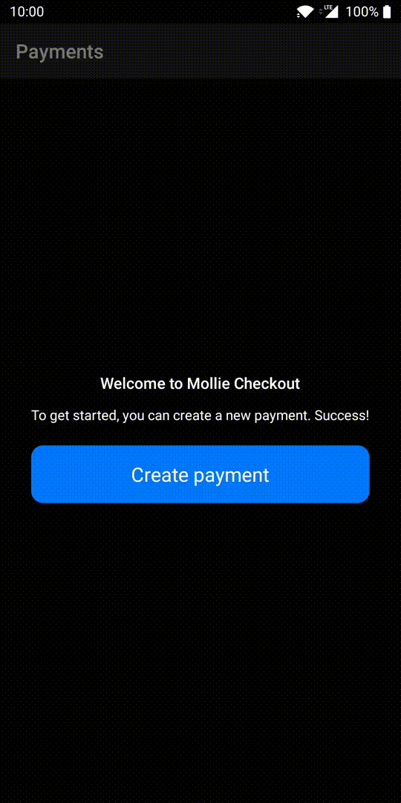

# Implementing the advanced flow



Instead of using an external browser, the advanced implementation executes the payment in an in-app browser. This enables you to style the payment flow so that it matches your app’s theme.

## Behaviour

When customers create a payment, the payment link opens in a WebView to execute the payment. If necessary, the WebView launches other native apps to complete the payment.

The payment result returns through a deep link or a callback in the WebView. The app refreshes the payment statuses when it’s opened, to ensure the latest statuses are shown in case the payment result doesn’t return.

## Implementation

>:warning: **Note**: Before implementing the advanced flow, implement the basic flow and change `Settings.Navigation.PAYMENT_FLOW` to `IN_APP_BROWSER` in [Settings.kt](app/src/main/java/com/mollie/checkout/Settings.kt).

The advanced flow consists of the following steps:

1.  [Create an in-app browser Activity](#create-an-in-app-browser-activity)
2.  [Configure the WebView settings](#configure-the-webview-settings)
3.  [Configure the WebViewClient](#configure-the-webviewclient)
4.  [Reload the payment status in the in-app browser Activity](#reload-the-payment-status-in-the-in-app-browser-activity)
5.  [Reload the payment status in the result Activity](#reload-the-payment-status-in-the-result-activity)

> ❗**Warning**: Incorrect implementation of the advanced flow can lead to payments not starting or incomplete payments due to universal linking issues.

### Step 1: Create an in-app browser Activity

To replace launching the payment link in the basic implementation, create an Activity that contains a WebView to load the payment, such as [InAppBrowserActivity.kt](app/src/main/java/com/mollie/checkout/feature/inappbrowser/InAppBrowserActivity.kt).

### Step 2: Configure the WebView settings

Your app should be able to load issuer and Mollie sites to include all payment flows. To do this, configure the WebView settings.

```kotlin
binding.webView.settings.javaScriptEnabled = true // Required to load Mollie and issuer sites.
binding.webView.settings.domStorageEnabled = true // Required to load some issuers that use HTML5 specifications to generate QR codes, such as Rabobank.
```

### Step 3: Configure the WebViewClient

In the in-app Activity, configure the WebViewClient on the WebView to handle callbacks and URLs.

```kotlin
binding.webView.webViewClient = object : WebViewClient() {

    override fun onPageStarted(view: WebView?, url: String?, favicon: Bitmap?) {
        super.onPageStarted(view, url, favicon)
        vm.onWebViewStartedLoading()
    }

    override fun onPageFinished(view: WebView?, url: String?) {
        super.onPageFinished(view, url)
        vm.onWebViewFinishedLoading()
    }

    override fun onReceivedError(
        view: WebView?,
        request: WebResourceRequest?,
        error: WebResourceError?
    ) {
        super.onReceivedError(view, request, error)
        Snackbar.make(binding.root, error.toString(), Snackbar.LENGTH_LONG).show()
    }

    override fun shouldOverrideUrlLoading(view: WebView?, url: String?): Boolean {
        val uri = Uri.parse(url)
        return handleUri(uri)
    }

    override fun shouldOverrideUrlLoading(
        view: WebView?,
        request: WebResourceRequest?
    ): Boolean {
        val uri = request?.url
        return handleUri(uri)
    }

    private fun handleUri(uri: Uri?): Boolean {
        uri?.scheme ?: return false
        val isMollieUrl =
            getString(R.string.in_app_browser_host_mollie) == uri.host?.replace("www.", "")
        when {
            isMollieUrl -> return false
            uri.scheme == getString(R.string.deeplink_scheme_app) -> {
                // It's our deeplink
                finish()
                val intent = Intent(this@InAppBrowserActivity, PaymentsActivity::class.java)
                intent.data = uri // Trigger as if coming from deeplink
                startActivity(intent)
                return true
            }
            uri.scheme == getString(R.string.deeplink_scheme_https) -> {
                // Normal URL inside WebView, loading it inside the WebView (triggers universal links directly if possible)
                return false
            }
            else -> {
                // Handling deeplinks
                return try {
                    // Try to launch externally
                    val intent = Intent(Intent.ACTION_VIEW)
                    intent.data = uri
                    startActivity(intent)
                    true
                } catch (e: ActivityNotFoundException) {
                    // A deeplink to an external app was triggered, but there is no app installed to handle this deeplink
                    Snackbar.make(binding.root, R.string.in_app_browser_failed_opening_link, Snackbar.LENGTH_LONG).show()
                    true
                }
            }
        }
    }
}
```

### Step 4: Reload the payment status in the in-app browser Activity

There are a number of situations where the customer doesn’t return to the app through a deep link or a callback. For example, when an external app is required to complete the payment, the external app calls the deep link to relaunch your app. In some cases, this is unsuccessful:

-   The current in-app Activity must close when the deep link is opened, otherwise the screen remains in the stack.
-   If a payment takes place asynchronously, the customer must return to the app manually. The app opens the last screen, which is the in-app Activity, even if the payment is already complete.

Therefore, it’s best practice to check whether the payment is complete when the customer returns to the app.

To check whether the payment is complete, reload the payment status when the Activity opens.

```kotlin
override fun onResume() {
    super.onResume()

    getPayment()?.id?.let { paymentId ->
        lifecycleScope.launch {
            val latestPayment = vm.getLatestPayment(paymentId)
            if (latestPayment?.status?.isCompleted == true) {
                Log.d("$javaClass", "Payment has been completed already, finishing")
                finish()
                Navigation.openPayments(this@InAppBrowserActivity, paymentId) // Refreshing the payments via `onNewIntent()`
            }
        }
    }
}
```

### Step 5: Reload the payment status in the result Activity

Reload the payment status on all relevant screens to show the latest payment status across your app.

In the demo app, the `checkCompletedPayment()` method in the in-app browser Activity launches the payments list so that it is handles it the same way as a deep link.

```kotlin
private fun checkCompletedPayment(intent: Intent?) {
    if (intent == null) {
        // We don't need to check for this intent, it is not a completed payment for sure
        return
    }

    val isFromDeeplink = intent.data?.scheme == getString(R.string.deeplink_scheme_app)
    val completedPaymentId = intent.getIntExtra(EXTRA_COMPLETED_PAYMENT_ID, -1)
    val isFromCompletedPayment = completedPaymentId != -1

    when {
        isFromDeeplink -> {
            // Payment data when called from deeplink
            val paymentId = intent.data?.path?.substring(1) // `path` starts with a `/`, removing that
        }
        isFromCompletedPayment -> {
            // Payment data when called from a completed payment
            val paymentId = completedPaymentId
        }
        else -> {
            // Opened this screen without a completed payment
        }
    }
}
```

## Next steps

After implementing the advanced flow, your app handles Mollie payments natively. You can extend this flow by [including payment method selection in your app](IMPLEMENT_PAYMENT_METHODS.md).

## Resources

Refer to the following source files for relevant samples:

- [InAppBrowserActivity.kt](app/src/main/java/com/mollie/checkout/feature/inappbrowser/InAppBrowserActivity.kt): example Activity containing the WebView.
- [PaymentsActivity.kt](app/src/main/java/com/mollie/checkout/feature/payments/PaymentsActivity.kt): contains additional handling of completed payments using the advanced flow.
