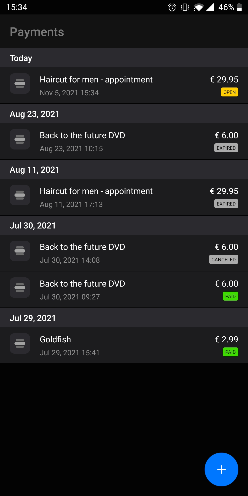
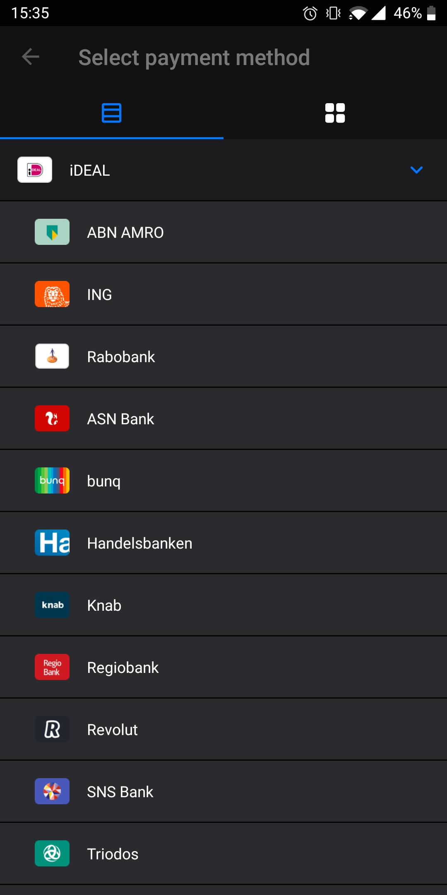
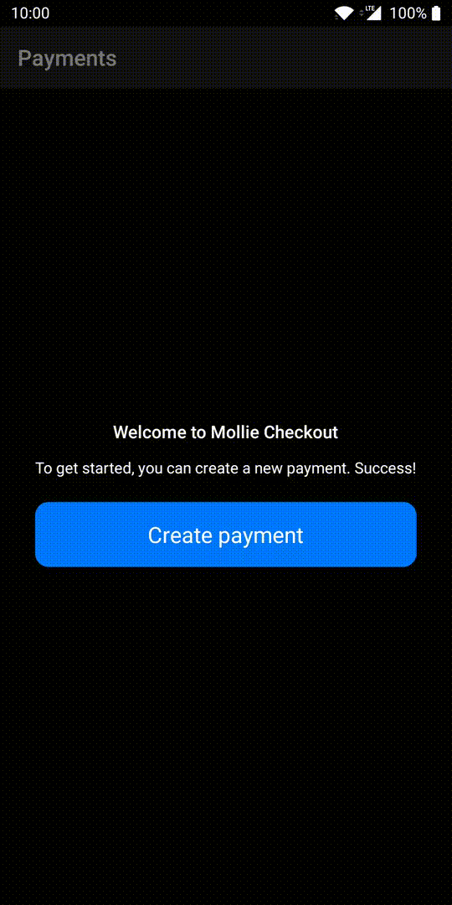

# Mollie Checkout Android

Mollie Checkout is a demonstration app that shows the recommended way of handling Mollie payments in Android.

This project aims to show what steps need to be taken into account when integrating Mollie in an Android app.

Mollie payments must be handled in a safe way via a backend. Therefore Mollie Checkout communicates with a backend. Check out the [Mollie Checkout Backend](https://github.com/mollie/demo-checkout-backend) about the backend details.

# Functionalities

Mollie Checkout focuses on the needed functionalities when handling payments. Features include:

- Retrieving list of payments
- Creating a payment
- Selecting the payment issuer and method
- Executing a payment (with the choice between two different flows)
- Handling the result after executing a payment
- Settings to try out the different flows

| Payments list | Create payment | Select method/issuer |
|---------------|----------------|----------------------|
|  |  |  |

# Flows

There are two flows that can be used to execute payments with Mollie, each having their pros and cons. Optionally the payment method selection can be customized as well.

## Flow 1: Basic (recommended)

With the basic flow the payment link is opened via the external browser on the device. After the payment is completed, the user returns to the app via a deeplink.

**Behavior**

- _External browser_: Launches the external browser with the payment link.
- _Native payments_: Native apps will opened where needed to execute the payment. 
- _Result - Deeplink_: In almost all cases the result comes back via the configured deeplink. 
- _Result - Refresh_: It is recommended to refresh the payment(s) in `onResume()` to make sure the payment(s) show the latest state.

**✅ Pros**

- _Basic implementation_: Takes less effort to implement.
- _Similar to web_: 100% equal to doing a Mollie payment via the browser on the device.
- _Most reliable_: The payment flow is handled natively by Mollie. Where needed it will interact with other apps to complete the payment.
- _Similar environment_: Both test and production payments are handled the same way.

**❗ Cons**

- _No theming_: The external browser isn't configurable in styling*. 

_* Some browsers support a bit of custom theming (such as _Chrome Custom Tabs_), but there is no guarantee that the user has that browser installed to see this._

 
 

## Flow 2: Advanced

The advanced flow differs from the basic flow in that the payment link is opened inside the app via a WebView. The WebView requires additional configuration and the user returns to the app via a deeplink, callback or by reopening the app manually.

**Behavior**

- _In-app browser_: Opens the payment url in an WebView in an owning Activity.
- _Result - Deeplink_: Result can come back via the deeplink.
- _Result - Callback_: Result can come back as callback in the WebView
- _Result - Refresh_: Result might not come back, requires refreshing the payment status in `onResume()` to detect the latest state of the payment.
  
**✅ Pros**

- _Custom theming_: Can fully style the components outside the WebView (the Activity, ToolBar, etc.).

**❗ Cons**

- _Advanced implementation_: Takes more effort to handle and test each case.
- _Error prone_: Requires additional handling on the WebView to regain a smooth experience for the user.
- _Launch native apps_: Requires checking for native apps to open links and launching the corresponding app where needed. 
- _Different environments_: Requires testing with real payments because production payments behave different compared to test payments.

> **Note:** Implementing the advanced flow in a wrong way can lead to;
> - Payments not being started
> - Payments not being completed (universal linking)

## Optional: Implement payment methods

Executing the payment can be separated in two parts: 
1. Selecting the payment method: such as iDeal, bank selection, creditcard, etc.
2. Pay the payment based on this selection: Filling in the required details or open the corresponding native app to finish the payment.

By default, Mollie will handle the payment method selection inside the web. 

However, it is possible to build this part of the process native as well. When building this natively, Mollie will just skip selecting the method when executing the payment in web.

| Web (default) | Native (optional) |
| ------------- | ----------------- |
| 
  
 | 
  
 |
| _Choose on execute_: The method can be chosen just before **executing** the payment. | _Choose on create_: The method has to be chosen before **creating** the payment. |
|**✅ Pros**|**✅ Pros**|
| _Decide later_: The user can decide the method when executing the payment. | _Custom theming_: Allows the method selection to be made in-app within the current theme. |
| _Less effort_: Method selection is handled automatically by Mollie. | |
|**❗ Cons**|**❗ Cons**|
| _No theming_: Uses default Mollie theme to select the method. | _Decide up-front_: The user cannot change to another payment method later. |
| | _Retrieve methods_: Requires both backend and app to implement a call to retrieve the methods. |
| | _Custom implementation_: Requires implementing the method selection natively. |

# Implementing Mollie

We recommend to first run this demo app to check out how it works. Next, follow the corresponding guide(s) for a step-by-step guide to implement these.

> **Note:** Make sure to set the right `BASE_URL` inside [Settings.kt](app/src/main/java/com/mollie/checkout/Settings.kt) before building the demo app.

## Requirements

A backend is needed to process the payments with the following features:
  - Creating a payment (required)
  - Retrieving payment (required)
  - Retrieving payments list (optional)
  - Retrieving payment methods (optional)

In Mollie Checkout we use the [Mollie Checkout Backend](https://github.com/mollie/demo-checkout-backend) which has all these features.

## Guides

- [Flow 1: Basic implementation (recommended)](FLOW_BASIC.md)
- [Flow 2: Advanced implementation](FLOW_ADVANCED.md)
- [Optional: Implement payment methods](IMPLEMENT_PAYMENT_METHODS.md)

_The source of Mollie Checkout can be used as a quick start. Note that Mollie Checkout has each guide implemented, which can be toggled via the settings. Check out [SOURCE.md](SOURCE.md) for a detailed explanation about the source of Mollie Checkout._
